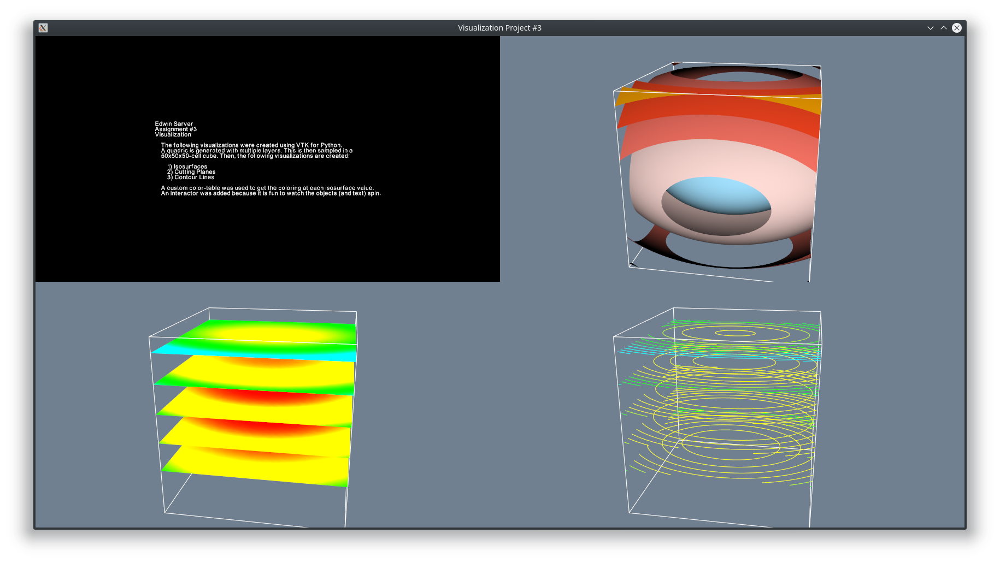

# [Visualization: Assignment #3](https://github.com/esarver/vis_proj3/) #
*Edwin Sarver*



    
The visualizations were created using VTK for Python, adapting the code from
various example and demos from 
[the Markdown version of the VTK Textbook](https://lorensen.github.io/VTKExamples/site/Python/).
A quadric is generated with multiple layers. This is then sampled in a 
50x50x50-cell cube. Then, the following visualizations are created:

1. Isosurfaces
2. Cutting Planes
3. Contour Lines 

A custom color-table was used to get the coloring at each isosurface value.
An interactor was added because it is fun to watch the objects (and text) spin.

# How To Run #

All instructions are to be performed in the project root directory. It could potentially
work in a Windows environment, though I have only tried it on Ubuntu 18.04.

## Install Python 3 ##
```bash
sudo apt update
sudo apt install python3 python3-pip
```

## Installing Dependencies ##
### Virtual Environment ###
**To install pipenv:**
```bash
pip3 install --user pipenv
```

After installing pipenv, navigate to your project root and do the following to set it up:
```bash
pipenv install
pipenv shell
pipenv install vtk #add any other dependencies here as well.
```

## Running ##
First, make `project.py` executable (if it isn't already).
```bash
chmod +x project.py
```

Now run in the `pipenv`:
```bash
pipenv run ./project.py
```
